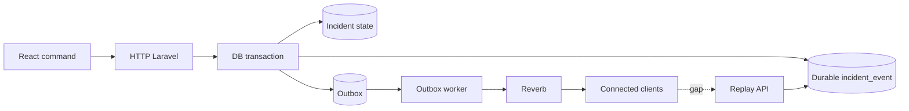

# Real-time architecture

```mermaid
flowchart LR
 C[React command] --> H[HTTP Laravel]
 H --> T[DB transaction]
 T --> I[(Incident state)]
 T --> E[(Durable incident_event)]
 T --> O[(Outbox)]
 O --> W[Outbox worker]
 W --> R[Reverb]
 R --> C2[Connected clients]
 C2 -. gap .-> RP[Replay API]
 RP --> E
```
HTTP owns commands and snapshots. WebSockets are a low-latency delivery path; durable events remain replayable after disconnects or broadcast outages.
